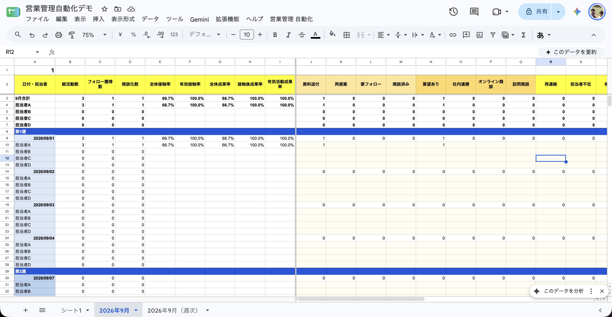

# Sales Report Automation Demo

Google Apps Scriptを利用して、営業活動の日次・週次・月次管理表を自動生成するデモツールです。

## 概要

年月を入力するだけで、対象月の平日を抽出し、以下を含む営業管理表を自動生成します。

- 日付ごとの入力欄
- 担当者ごとの入力欄
- 週ごとのグループ
- 日次集計
- 担当者別の月次集計
- チーム全体の月次集計
- 週次集計
- 接触率・成果率などの自動計算
- 表の色分けと入力規則

このリポジトリは、実務で開発した業務自動化の知見をもとに、公開用として再設計したデモです。

実在する企業、顧客、従業員の情報や、社内データは含まれていません。

## 開発背景

月初に営業管理表を作成する際、次の作業を手動で行う必要がありました。

1. 対象月の日付を入力する
2. 土日を除外する
3. 日付を週ごとに分ける
4. 担当者ごとの入力行を作成する
5. 日次・週次・月次の数式を設定する
6. 見出しや背景色を整える
7. 集計範囲に誤りがないか確認する

これらの作業には時間がかかり、数式のコピー漏れや参照範囲のずれが発生する可能性もありました。

そこで、作業工程を分解し、Google Apps Scriptで自動化しました。

## 改善結果

実務版では、従来SVが約2時間を要していた月次管理表の作成作業を、年月を入力して実行するだけで、約10秒で完了できる状態へ改善しました。

```text
改善前：約2時間
改善後：約10秒
```

※上記は実務環境での改善結果です。本リポジトリは、機密情報を除いて再構成した公開用デモです。

## 主な機能

### 日次管理表

- 指定月の平日を自動抽出
- 月曜日始まりで週を自動分類
- 担当者ごとの入力行を自動生成
- 日ごとの合計を自動計算
- 担当者ごとの月間合計を自動計算
- チーム全体の月間合計を自動計算
- 接触率・成果率を自動計算
- 入力セルへ数値制限を設定
- 週ごとに背景色を変更

### 週次管理表

- 日次管理表の数値を自動参照
- 担当者別の週次実績を自動集計
- 担当者別の月間実績を自動集計
- チーム全体の月間実績を自動集計
- 週ごとの目標入力欄を生成
- 接触率・成果率を自動計算

### 操作

スプレッドシート上部に専用メニューを追加します。

```text
営業管理 自動化
└── 月次管理表を作成
```

メニューから年と月を入力すると、日次シートと週次シートが作成されます。

## 使用技術

- Google Apps Script
- JavaScript
- Google Sheets

## ファイル構成

```text
sales-report-automation-demo/
├── README.md
├── .gitignore
└── src/
    ├── appsscript.json
    ├── config.gs
    ├── daily-formulas.gs
    ├── daily-sheet.gs
    ├── date-utils.gs
    ├── menu.gs
    ├── weekly-formulas.gs
    └── weekly-sheet.gs
```

### 各ファイルの役割

| ファイル | 役割 |
|---|---|
| `config.gs` | 担当者、色、見出しなどの設定 |
| `menu.gs` | カスタムメニューと作成処理 |
| `date-utils.gs` | 平日の抽出、週分け、列記号変換 |
| `daily-sheet.gs` | 日次管理表の作成 |
| `daily-formulas.gs` | 日次・月次集計式の設定 |
| `weekly-sheet.gs` | 週次管理表の作成 |
| `weekly-formulas.gs` | 週次・月次集計式の設定 |
| `appsscript.json` | Apps Scriptの実行環境設定 |

## 導入方法

### 1. スプレッドシートを作成

Googleスプレッドシートで、新しい空のスプレッドシートを作成します。

### 2. Apps Scriptを開く

スプレッドシート上部のメニューから、次を選択します。

```text
拡張機能 → Apps Script
```

### 3. ファイルを追加

Apps Script上で、`src`フォルダにある各`.gs`ファイルと同じ名前のファイルを作成し、コードを貼り付けます。

### 4. スプレッドシートを再読み込み

コードを保存した後、元のスプレッドシートを再読み込みします。

### 5. 月次管理表を作成

上部に表示される以下のメニューを選択します。

```text
営業管理 自動化 → 月次管理表を作成
```

作成したい年と月を入力すると、以下の2つのシートが作成されます。

```text
2026年9月
2026年9月（週次）
```

## 設定変更

担当者を変更する場合は、`config.gs`の以下を編集します。

```javascript
members: [
  '担当者A',
  '担当者B',
  '担当者C',
  '担当者D'
]
```

人数を増減した場合も、日次・週次シートへ自動反映されます。

## 工夫した点

### 1. 業務工程の分解

手作業を、日付生成、週分け、担当者行生成、数式設定、書式設定に分解して実装しました。

### 2. 設定と処理の分離

担当者名、色、列数、見出しを`config.gs`へまとめ、変更しやすい構成にしました。

### 3. 集計ミスの防止

日次・週次・月次の参照式を自動設定することで、数式のコピー漏れや参照範囲のずれを防止しています。

### 4. 安全な再実行

同じ年月のシートが存在する場合は確認画面を表示し、利用者が許可した場合のみ初期化します。

### 5. 入力ミスの防止

入力欄には、0以上の数値のみを許可する入力規則を設定しています。

## 注意事項

- 公開版の担当者名とデータはすべて架空です
- 実在する企業・顧客・従業員の情報は含まれていません
- 土日は自動的に除外されます
- 祝日は現在のバージョンでは自動除外されません
- 同じ年月のシートを作り直すと、既存内容は初期化されます
- 実行前に必要なデータをバックアップしてください

## 今後の改善案

- 日本の祝日の自動除外
- 設定画面からの担当者変更
- グラフによる実績推移の可視化
- CSV出力
- テストコードの追加
- 大量データ作成時の処理速度改善

## Disclaimer

本リポジトリはポートフォリオ用のデモです。公開されているコードとデータは、実務上の機密情報を含まないよう再構成しています。

## デモ画面

以下は、架空の担当者・数値を使用して作成した日次管理表のデモ画面です。



